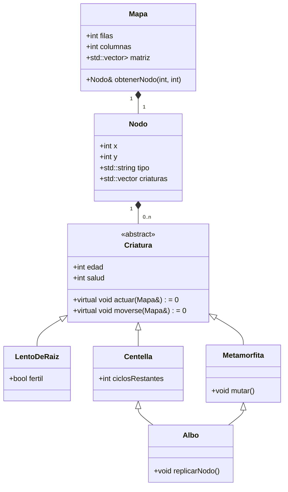

```mermaid 
classDiagram
class Nodo {
+int x
+int y
+std::string tipo
+std::vector<Criatura*> criaturas
}

    class Mapa {
        +int filas
        +int columnas
        +std::vector<std::vector<Nodo>> matriz
        +Nodo& obtenerNodo(int, int)
    }

    class Criatura {
        <<abstract>>
        +int edad
        +int salud
        +virtual void actuar(Mapa&) = 0
        +virtual void moverse(Mapa&) = 0
    }

    class LentoDeRaiz {
        +bool fertil
    }

    class Centella {
        +int ciclosRestantes
    }

    class Metamorfita {
        +void mutar()
    }

    class Albo {
        +void replicarNodo()
    }

    Criatura <|-- LentoDeRaiz
    Criatura <|-- Centella
    Criatura <|-- Metamorfita
    Centella <|-- Albo
    Metamorfita <|-- Albo
    Nodo "1" *-- "0..n" Criatura
    Mapa "1" *-- "1" Nodo

```