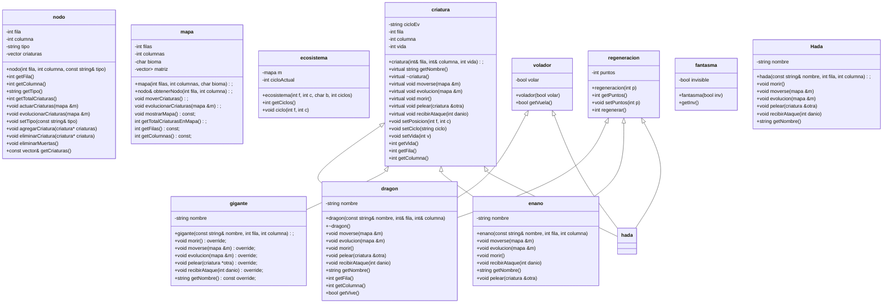

```mermaid
classDiagram
    class nodo {
        -int fila
        -int columna
        -string tipo
        -vector<criatura*> criaturas
        +nodo(int fila, int columna, const string& tipo)
        +int getFila() 
        +int getColumna() 
        +string getTipo() 
        +int getTotalCriaturas()
        +void actuarCriaturas(mapa &m)
        +void evolucionarCriaturas(mapa &m)
        +void setTipo(const string& tipo)
        +void agregarCriatura(criatura* criaturas)
        +void eliminarCriatura(criatura* criatura)
        +void eliminarMuertas()
        +const vector<criatura*>& getCriaturas()
        
    }   

    class mapa {
        -int filas
        -int columnas
        -char bioma
        -vector<vector<nodo>> matriz
        +mapa(int filas, int columnas, char bioma);
        +nodo& obtenerNodo(int fila, int columna);
        void moverCriaturas();
        void evolucionarCriaturas(mapa &m);
        void mostrarMapa() const;
        int getTotalCriaturasEnMapa();
        int getFilas() const;
        int getColumnas() const;
       
    }
    
    class ecosistema {
        -mapa m
        -int cicloActual
        +ecosistema(int f, int c, char b, int ciclos)
        +int getCiclos()
        +void ciclo(int f, int c)
    }

    class criatura {
        -string cicloEv
        -int fila
        -int columna
        -int vida
        +criatura(int& fila, int& columna, int vida);
        +virtual string getNombre()
        +virtual ~criatura()
        +virtual void moverse(mapa &m)
        +virtual void evolucion(mapa &m)
        +virtual void morir()
        +virtual void pelear(criatura &otra)
        +virtual void recibirAtaque(int danio)
        +void setPosicion(int f, int c)
        +void setCiclo(string ciclo)
        +void setVida(int v)
        +int getVida() 
        +int getFila() 
        +int getColumna() 
    }
    
    class volador{
        -bool volar
        +volador(bool volar)
        +bool getVuela()
    }
    
    class regeneracion{
        -int puntos
        +regeneracion(int p)
        +int getPuntos()
        +void setPuntos(int p)
        +int regenerar()
    }
        
    class fantasma{
        -bool invisible
        +fantasma(bool inv)
        +getInv()
    }

    class enano {
        -string nombre
        +enano(const string& nombre, int fila, int columna)
        +void moverse(mapa &m) 
        +void evolucion(mapa &m) 
        +void morir() 
        +void recibirAtaque(int danio) 
        +string getNombre() 
        +void pelear(criatura &otra) 
    }

    class gigante {
        -string nombre
        +gigante(const string& nombre, int fila, int columna);
        +void morir() override;
        +void moverse(mapa &m) override;
        +void evolucion(mapa &m) override;
        +void pelear(criatura *otra) override;
        +void recibirAtaque(int danio) override;
        +string getNombre() const override;
    }

    class dragon {
        -string nombre
        +dragon(const string& nombre, int& fila, int& columna)
        +~dragon()
        +void moverse(mapa &m)
        +void evolucion(mapa &m)
        +void morir() 
        +void pelear(criatura &otra) 
        +void recibirAtaque(int danio)
        +string getNombre()
        +int getFila() 
        +int getColumna() 
        +bool getVive()
    }

    class Hada {
        -string nombre
        +hada(const string& nombre, int fila, int columna);
        +void morir() 
        +void moverse(mapa &m) 
        +void evolucion(mapa &m)
        +void pelear(criatura &otra)
        +void recibirAtaque(int danio) 
        +string getNombre() 

    }
    

    criatura <|-- dragon
    criatura <|-- gigante
    criatura <|-- enano
    criatura <|-- hada
    
    volador <|-- dragon
    volador <|-- hada
    
    regeneracion <|-- dragon
    regeneracion <|-- enano
    regeneracion <|-- hada


```